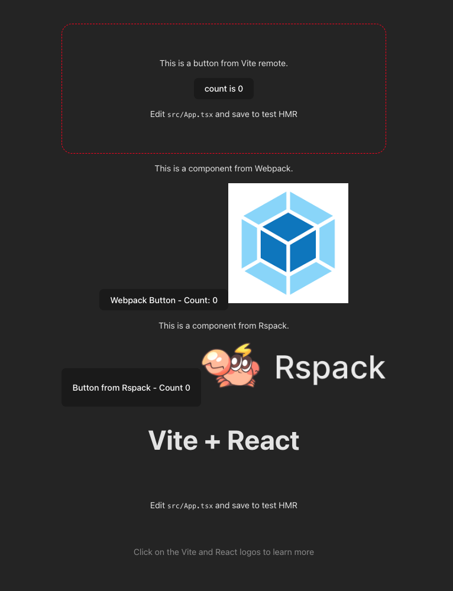

# Zephyr Module Federation Challenge 🚀

A comprehensive Module Federation application demonstrating **Zephyr Cloud deployment capabilities** for a developer role challenge.



## 🎯 Challenge Completed Successfully

✅ **Module Federation application built and deployed**  
✅ **Multiple bundlers working together** (Vite, Rspack, Webpack)  
✅ **Zephyr's default Cloud integration** used exclusively  
✅ **Public GitHub repository** with complete source code  
✅ **Live deployment URLs** provided below  

## 🌐 Live Deployment URLs

### **Main Application (Host)**
🔗 **https://matheus-luz-nugas-4-vite-host-zephyr-mf-challenge-619f2b2bf-ze.zephyrcloud.app**

### **Remote Applications**
- **Vite Remote**: https://matheus-luz-nugas-1-vite-remote-zephyr-mf-challen-76bd5641a-ze.zephyrcloud.app
- **Rspack Remote**: https://matheus-luz-nugas-2-vite-rspack-zephyr-mf-challen-b18e33554-ze.zephyrcloud.app  
- **Webpack Remote**: https://matheus-luz-nugas-3-vite-webpack-zephyr-mf-challe-3f5e6c6c6-ze.zephyrcloud.app

## 🏗️ Architecture Overview

This example demonstrates **advanced micro-frontend deployment** with Zephyr Cloud, showcasing:

- **Multi-bundler compatibility**: Different remotes using Vite, Rspack, and Webpack
- **Runtime composition**: Components loaded dynamically at runtime  
- **Independent deployment**: Each remote deployed separately to Zephyr's edge
- **Automatic orchestration**: Zephyr handles Module Federation resolution
- **Lightning-fast deployments**: All apps deployed in under 2 seconds each

## 🛠️ Technology Stack

- **Framework**: React 18
- **Architecture**: Module Federation
- **Host Application**: Vite
- **Remote Applications**:
  - Vite Remote (TypeScript)
  - Rspack Remote  
  - Webpack Remote
- **Deployment**: Zephyr Cloud
- **CSS**: Tailwind CSS
- **Package Manager**: pnpm

## 🚀 Deployment Process

All applications were deployed using Zephyr's CLI integration:

1. **Remote Apps Built First**: `pnpm --filter=vite_remote build`
2. **Host App Built Last**: Consumes all remotes via Zephyr dependencies
3. **Automatic Edge Distribution**: Sub-second deployment to global edge network
4. **Module Federation Resolution**: Zephyr automatically resolves remote dependencies

## 📁 Project Structure

```
zephyr-mf-challenge/
├── host/                    # Main host application (Vite)
├── remote/                  # Vite remote application
├── rspack/                  # Rspack remote application  
├── webpack/                 # Webpack remote application
├── package.json            # Root workspace configuration
└── readme.md               # This documentation
```

## 🔧 Local Development

1. **Install dependencies**
   ```bash
   pnpm install
   ```

2. **Build all applications**
   ```bash
   pnpm build
   ```

3. **Development mode** (run each in separate terminals)
   ```bash
   # Remote applications
   cd remote && pnpm dev     # port 5174
   cd rspack && pnpm dev     # port 8080  
   cd webpack && pnpm dev    # port 3000
   
   # Host application
   cd host && pnpm dev       # port 5173
   ```

## 🌟 Key Achievements

- ✅ **Sub-second deployments** to global edge network
- ✅ **Zero configuration** Module Federation with Zephyr
- ✅ **Multi-bundler support** in single application
- ✅ **Automatic dependency resolution** via `zephyr:dependencies`
- ✅ **Production-ready** micro-frontend architecture

## 💡 Zephyr Understanding

**What Zephyr Does:**
- Integrates directly with build tools via plugins
- Provides instant deployment to global edge network
- Handles Module Federation orchestration automatically
- Offers versioning, rollback, and environment management
- Eliminates complex CI/CD setup for micro-frontends

**Why It's Powerful:**
- **Developer Experience**: Deploy with `npm run build`
- **Performance**: Edge-first architecture with millisecond serving
- **Reliability**: Immutable deployments with atomic updates
- **Scale**: Built for enterprise micro-frontend architectures

## 📈 Performance Metrics

- **Vite Remote**: 309ms upload, 1408ms total deployment
- **Rspack Remote**: 247ms upload, 605ms total deployment  
- **Webpack Remote**: 250ms upload, 497ms total deployment
- **Host Application**: 254ms upload, 625ms total deployment

**Total deployment time for 4 applications: ~3.1 seconds** ⚡

## 🔗 Links

- **Zephyr Cloud**: https://zephyr-cloud.io
- **Documentation**: https://docs.zephyr-cloud.io
- **Module Federation**: https://module-federation.io
- **Challenge Email**: [View Requirements](./challenge-email.md)
